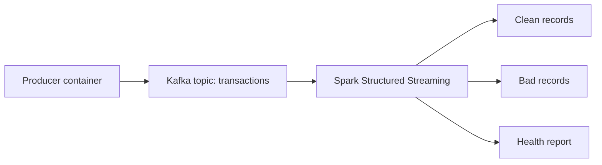

# Mini Kafka PySpark Docker Pipeline

A Dockerized streaming data quality pipeline with Kafka, PySpark Structured Streaming, and a synthetic transaction producer.

This project is the cleaner Docker version of a local Windows learning pipeline. Spark runs inside a Linux container, so users do not need local Java, `winutils.exe`, or `hadoop.dll`.

## Why This Project Exists

The goal is to demonstrate an end-to-end data engineering workflow:

- Generate realistic transaction events
- Publish events to Kafka
- Consume Kafka events with PySpark Structured Streaming
- Apply data quality rules
- Split clean and bad records
- Produce a small streaming health report
- Run the full stack with Docker Compose

## Architecture

```text
producer container
  -> Kafka topic: transactions
  -> Spark Structured Streaming container
  -> output/clean_data
  -> output/bad_records
  -> output/health_report/latest
```



The `kafka-init` container creates the `transactions` topic before Spark starts, which avoids startup timing issues.

## Project Structure

```text
mini-kafka-pyspark-docker-pipeline/
|-- .github/workflows/ci.yml
|-- .env
|-- docker-compose.yml
|-- producer/
|   |-- Dockerfile
|   |-- producer.py
|   `-- producer_kafka.py
|-- scripts/
|   |-- clean_runtime.ps1
|   |-- run_pipeline.ps1
|   `-- run_producer.ps1
|-- spark_jobs/
|   |-- Dockerfile
|   `-- streaming_cleaning_job.py
|-- src/
|   `-- quality/
|       `-- rules.py
|-- tests/
|   `-- test_quality_rules.py
|-- requirements.txt
|-- README.md
`-- .gitignore
```

## Configuration

Runtime settings live in `.env`:

```text
KAFKA_TOPIC=transactions
KAFKA_BOOTSTRAP_SERVERS=kafka:9092
PRODUCER_BATCHES=10
PRODUCER_RECORDS_PER_BATCH=10
PRODUCER_BAD_RECORDS_PER_BATCH=3
PRODUCER_SLEEP_SECONDS=1
SPARK_PACKAGE_VERSION=4.1.1
```

## Run End-to-End

Start Kafka, create the topic, and start Spark:

```powershell
docker compose up --build -d kafka spark
```

Monitor Spark:

```powershell
docker compose logs -f spark
```

In another terminal, publish records:

```powershell
docker compose run --rm producer
```

Check generated output:

```powershell
Get-ChildItem output\clean_data
Get-ChildItem output\bad_records
Get-ChildItem output\health_report\latest
```

Stop the stack:

```powershell
docker compose down
```

Clean generated runtime files:

```powershell
Remove-Item -Recurse -Force output -ErrorAction SilentlyContinue
```

## Helper Scripts

PowerShell helper scripts are included for convenience:

```powershell
.\scripts\run_pipeline.ps1
.\scripts\run_producer.ps1
.\scripts\clean_runtime.ps1
```

## Data Quality Rules

A record is marked bad when:

- `transaction_id` is missing
- `user_id` is missing
- `email` is missing or does not contain `@`
- `amount` is missing or less than or equal to zero
- `event_time` is missing

The reusable rule constants and unit-testable record validator live in:

```text
src/quality/rules.py
```

## Expected Output

Spark writes JSON part files under:

```text
output/clean_data/
output/bad_records/
output/health_report/latest/
output/checkpoints/
```

`output/` is ignored by Git because it contains generated runtime data and streaming checkpoints.

## Tests

Run unit tests locally:

```powershell
pip install -r requirements-dev.txt
python -m pytest tests
```

GitHub Actions also runs the unit tests on push and pull request.

## Troubleshooting

Check running containers:

```powershell
docker compose ps
```

View Spark logs:

```powershell
docker compose logs -f spark
```

View Kafka logs:

```powershell
docker compose logs -f kafka
```

If output folders are missing, confirm Spark is running before sending producer records.

If Spark fails while resolving Kafka packages, rebuild Spark:

```powershell
docker compose build --no-cache spark
```

## Current Limitations

This is a portfolio-scale learning pipeline, not a production platform. Future improvements could include:

- Schema Registry with Avro or Protobuf
- Great Expectations or Deequ-style quality checks
- Prometheus/Grafana monitoring
- Spark cluster mode
- Dead-letter Kafka topic for bad records
- Integration tests that run the full Docker stack in CI

## Why Docker

Running Spark locally on Windows can require Hadoop native helper files such as `winutils.exe` and `hadoop.dll`. This project keeps the runtime inside Docker so contributors can run the pipeline with Docker commands instead of configuring Spark and Hadoop on their host machine.
